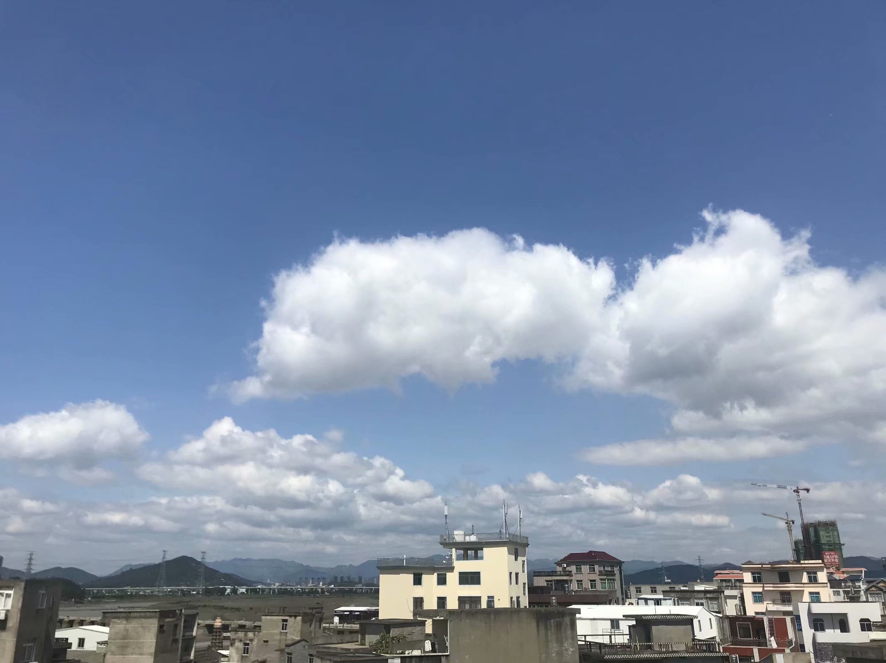
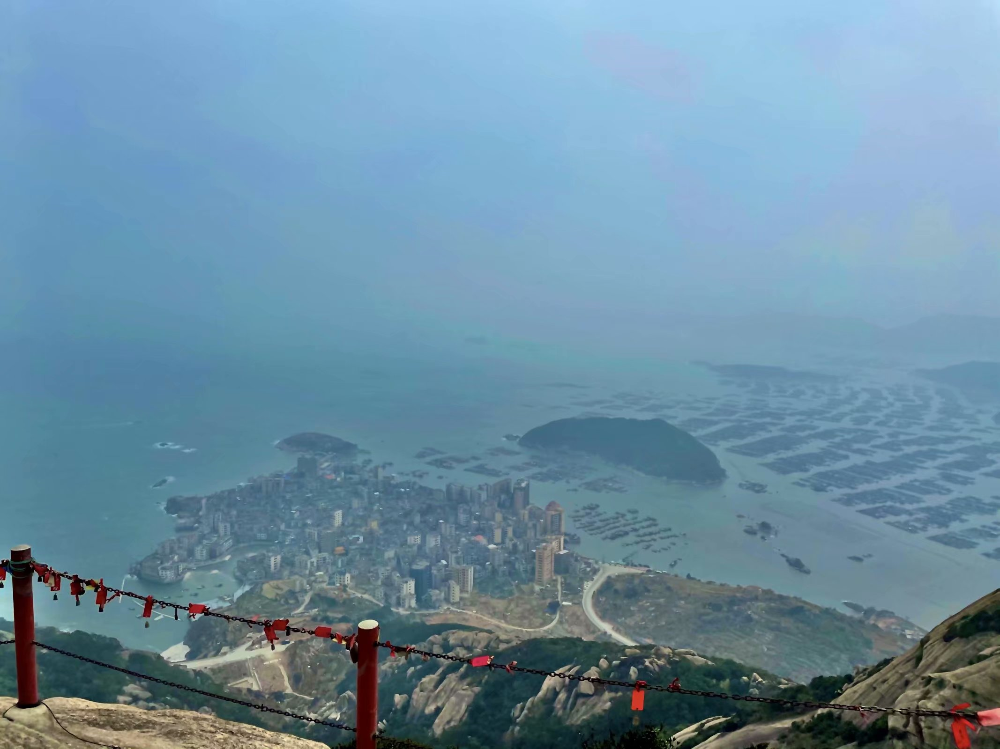
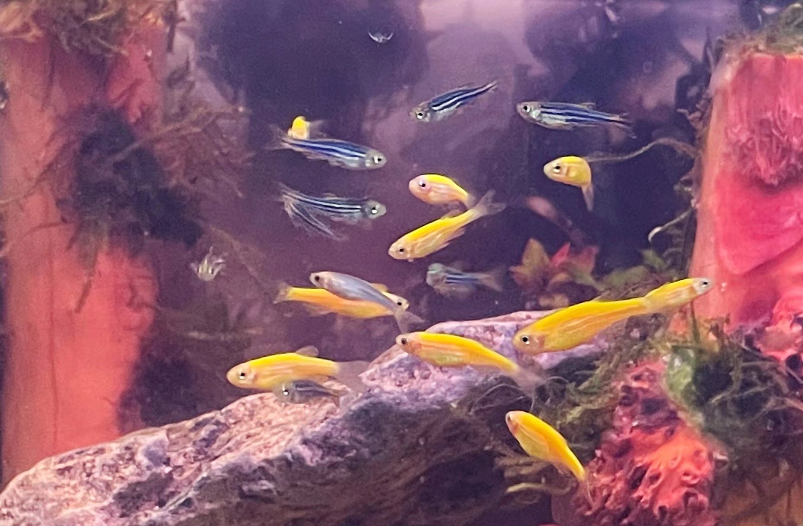

# 诗词

## 2020年
### 四月十二观云（2020.04.12）

四月十二日，晴。   
支颐远望，和风入怀，燕莺无须争暖树。   
日下白云欲何处，停而不发可知春将暮？   
开学遥遥不知期，书卷难翻竟已人麻木。  

### 八月十五望月有感（2020.10.01）

双节罕遇就今**年**，飒飒秋风桂魄**悬**。  
欲往蟾宫抟鹤翼，又忧冒昧扰仙**垣**。  
烟横水畔华灯绽，酒满杯中皓月**圆**。  
慰己偷闲非懈怠，驻足只为更将**前**。  

### 庚子霜序赋创新港（2020.10.25）
临渭水而清渊洋，接秦岭而神山峨。  
秦宫汉苑已燹，玮楼巨构今成。  
力敏躬行，涵英泓理。  
工理医文，人才济济。  
二十三院起万钧。  
梧桐红枫，芳草如积。  
庠序为本，科研不止。  
百二四年皆如是。  
楼可接霓，天地相交。  
群贤满座，上下志通。  
贪泉觉爽，不忘西迁精神。  
饮水思源，勇担时代重任。  
大势瑰异，雷霆常激，愿西交奋飞不辍，引耀世界！  

### 周末（2020.11.08）
午后天台静，晴时云天新。  
浅酌与友乐，夤夜暂忘机。

### 冬至（2020.12.20）
连呼酒，炙肉佐之，冬至至而春也将来！

## 2021年

### 腊月十七登山望海

风岭梵音**悠**，薄雾海上**流**。  
海流石不转，望尽片片**舟**。

### 除夕
世路役役莫沉**溺**，唯精唯一且持**之**。  
烟花夜放嫌春**迟**，争作东风第一**枝**。

### 青玉案·除夕 

尘埃北斗盈杯**盏**，又一载、山河**眄**。物是人非欻似**电**。岁迎辛丑，月起新朔，好景值人**愿**。 

万家檐上炊烟**满**，纵是金龙羡归**雁**。试问何声惊迥**汉**？青冥云**伴**，烟花竹爆，也趁东风**绽**。

### 摸鱼儿·摸鱼人（2021.04.05）
  
清明**雨**，缱绻纷飞几**处**。搦管无声一**赋**。鱼虾龟蟹知何事，大眼小眼相**觑**。  
急去**去**。晚风沁、光流灯转今如**遇**。玲珑趣**语**。便未饮金波，曼颊漪起，嬉问可心**许**。

### 如梦令·一人闲逛独酌为己庆二十四岁（2021.07.25）
去伴浮云风**景**，一人携影为**庆**。  
独酌晚风醇，贪酒几杯仍**醒**。  
尽**兴**，尽**兴**，皓月冰心相**映**。  

### 辛丑中秋

#### 临江仙·中秋（惆怅版）_莫为悲秋浪赋诗，奈何最愁是秋思。_
彤榴橙柿迎秋望，孤梧横臂拥**风**。素云辞雨上青**穹**，翠竹沾露笑枫**红**。

蝶化庄生然入梦，未曾折桂蟾**宫**。忽醒何处远樊**笼**，留云邀月奈盅**空**。

#### 临江仙·中秋（豁达版）_何人解识秋甚美，莫为悲秋浪赋诗。_
彤榴橙柿迎秋望，桂香又携清**风**。素云辞雨上青**穹**，翠竹沾露笑枫**红**。

遥向剑铓休旋踵，虎刀翎箭雕**弓**。忽醒何处月弗**同**，留云邀月再一**盅**。

#### 注1：
- 彤：红色。彤、橙皆为鲜活之色，以反衬孤梧。
- 秋望：农历八月又称仲秋。月之十五为望。故用秋望指代八月十五。
- 孤梧：梧桐意象之一便是孤寂，孤梧为甚，又谐音“孤吾”。
- 素云辞雨上青穹：素为白色。连日秋雨止歇，白云重新飘上蓝天。
- 翠竹沾露笑枫红：竹子四季常青，沾露未晞，秋风吹过竹丛，好似在笑枫叶惹了秋红，好看是好看，却不长久。竹笑本形容竹子姿态，这里进一步拟人为哂笑。宋·苏轼《石室先生画竹赞》：竹亦得风，夭然而笑。
- 蝶化庄生然入梦：蝶化庄生用来比喻幻境、梦境，出自《庄子·齐物论》。然意为虽然，即使。即使在梦中，也未曾有过下文的“折桂蟾宫”。
- 折桂蟾宫：即蟾宫折桂，指攀折月宫桂花。在古时科举时代比喻应考得中。出自《晋书·郤诜传》。这里借指取得成果。
- 樊笼：关鸟兽的笼子。借喻不得自由之境。晋·陶渊明《归园田居（其一）》：久在樊笼里，复得返自然。
- 留云邀月奈盅空：本想用“留云借月”，可平仄不对，因此改为邀。无酒挽留明月彩云，与无处可远樊笼相呼应。宋·朱敦儒《鹧鸪天·西都作》：曾批给雨支风券，累上留云借月章。诗万首，酒千觞。几曾着眼看侯王。
#### 注2：
- 遥向剑铓休旋踵，虎刀翎箭雕弓：唐·柳宗元《与浩初上人同看山寄京华亲故》中有：海畔尖山似剑铓，秋来处处割愁肠。这里用剑铓指代秋愁。休旋踵意为不回头。踵即脚后跟。整句想表达莫要向着秋愁妥协，用我的刀剑弓弩一战。
- 忽醒何处月弗同，留云邀月再一盅：忽然醒悟，感叹哪里的明月会不相同呢？不妨邀请天上云月，再满上一盅酒。

### 蝶恋花·立冬初雪又晴（仿写自@墨色）

枯树茕灯缠玉**屑**。瑟瑟寒风，吹彻霾天**裂**。  
走马川行蹄印**雪**，此程已过重山**叠**。  

梦醒初心犹未**灭**。回首经年，尘土衬孤**月**。  
晓照前楼成金**阙**，冬阳始替凛凛**夜**。  

## 2022年

### 西江月·疫情封校暨跨年随感（2022.01.01）
校官多为鲁叟，管封可见虚**颜**。新年新月艳阳**天**，静待青耕自**现**。

应有二三竖子，对牛不奏空**弦**。世间未闻未散**筵**，此刻难得别**卷**。

### 除夕有感
孩童时，除夕只喜光年换。  
青年时，新岁但觉岁月虚。  
新桃换旧符，爆竹祛罔象。  
流水能西，桑榆亦非晚。  
韶颜壮齿，诗酒正当年。  
此火树银花之景，当陈一愿，唯平唯安。

### 记某次实验（2022.06.01）

来路不明的冲击，和难料的润滑跑合  
我都有很大嫌疑  
我承认  
所监测的全部频谱都在我这里  
而特征频率是你

### 游太平峪（2022.06.04）

阳春旭风樱花酿  
盛夏阵雨菠萝啤  
人生不过数秋  
当赴莫等冬

### 雨夜偶成（2022.06.12）
  
雨骤何逐身上**虹**，  
云谲怎窃心头**峰**。  
宵分皓月清香**送**，  
伴我怡然又几**程**。  

## 2023年

### 西江月·新年佳愿

赤码白签人**怯**，三番改火终**歇**。重拾竹杖并芒**鞋**，犯难图远勋**业**。

烟月康衢对望，金风良夜相**携**。遍邀词阕与诗**节**，借尽佳言吐**屑**。

#### 注：

- 三番改火：三年。古代钻木取火，四季换用不同木材，称为'改火'，又称改木。亦用以比喻时节改易。
- 竹杖并芒鞋：宋·苏轼《定风波·莫听穿林打叶声》：竹杖芒鞋轻胜马，谁怕？一蓑烟雨任平生。
- 犯难图远：2022年12月31日，习近平2023新年贺词：“明天的中国，奋斗创造奇迹。苏轼有句话：‘犯其至难而图其至远’，意思是说‘向最难之处攻坚，追求最远大的目标’。路虽远，行则将至；事虽难，做则必成。只要有愚公移山的志气、滴水穿石的毅力，脚踏实地，埋头苦干，积跬步以至千里，就一定能够把宏伟目标变为美好现实。”
- 烟月康衢：即康衢烟月，月光隐隐照映在繁华大街上的景象。后来经常被用来歌颂太平盛世的富饶景象。
- 金风：金风玉露一相逢，便胜却人间无数。
- 佳言吐屑：晋代胡毋辅之，字彦国。生性不拘小节，时出妙语。友人王澄曾与人书曰：『彦国吐佳言如锯木屑，霏霏不绝，诚为后进领袖也。』见晋书˙卷四十九˙胡毋辅之传。
